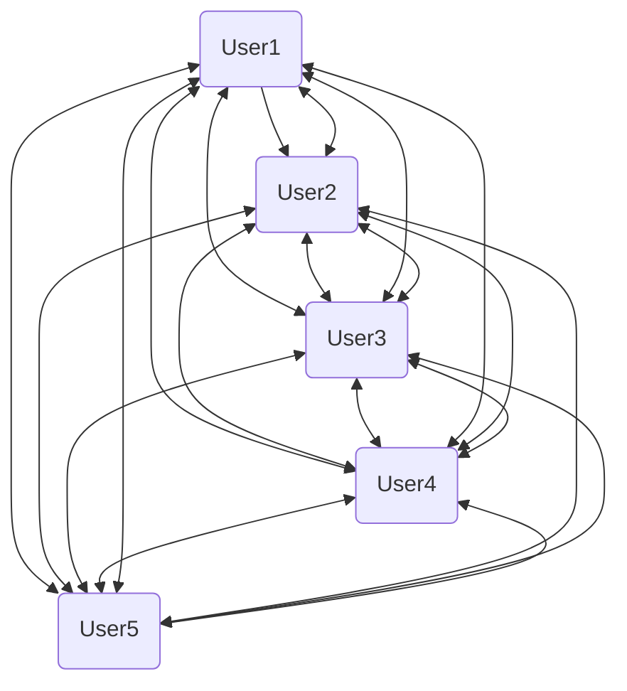

  

# BeeMail 2.0

Welcome to BeeMail 2.0, the buzziest messaging service in the world!

Why 2.0, I hear you ask? Well, read on dear developer...

## Background

When we built 1.0, we only had a `User` class. Users sent messages _directly_ to
each other. It seemed like the simplest solution but, erm... just look at this:

Every user needed to have access to a list of all other users. Frankly it was a
mess. We need a different approach.

## Getting started

This project can be completed in any language that supports classes.

To get started:

1. Create a project in your language's project framework

2. Read through the [project requirements](/TODO.md) - it's up to you how to
   implement them

## Patterns

- Can you make use of the **singleton** pattern to ensure only one `App` can be
  created?

- `App` is a **mediator** allowing users to message each other - why is this a
  better solution than users messaging each other directly?

- Check the extensions for a task requiring the **adapter** pattern.
