# Requirements

We recommend you make three classes: `App`, `User` and `Message`.

The new pattern we're following looks something like this:

## App

- `users` is a collection of all users who have logged into the app

- `addUser()` handles adding a new user to the `users` collection

- `findUser()` gets the user with the given id from the `users` collection, if
  possible

- `deliverMessage()` uses the given information to create a new instance of
  message, and delivers it to the recipient

## User

- `id` is a unique string which identifies the user

- `username` is the user's username

- `inbox` is a list of messages the user has received

- `app` is the instance of `App` the user is logged into

- `login(app)` adds the user to `app.users` and also sets `user.app` to `app`

- `sendMessage()` creates a new message and adds it to the `messages` array of
  the recipient user

- `receiveMessage()` handles adding an incoming message to the `messages` array

- `readMessage()` logs the message at the given index in `messages` to the
  console, and marks the message as read

## Message

- `id` is a unique id which identifies the message

- `datetime` is the time at which the message was created

- `content` is the text content of the message created by the sender

- `from` is the instance of `User` that sent the message

- `to` is the instance of `User` that receives the message

- `delivered` is true once the recipient has received the message

- `read` is true one the recipient has read the message

- `log()` prints the message details to the console in a readable format

- `markDelivered()` sets `delivered` to true

- `markRead()` sets `read` to true

## Sequence

```mermaid
sequenceDiagram
    participant User
    participant App
    participant Recipient
    participant Message

    User ->> App: login()
    App -->> User: set app
    App ->> App: add user to users

    User ->> App: sendMessage()
    App ->> Message: createMessage()
    App ->> App: findUser(recipientId)
    App ->> Recipient: deliverMessage()

    Recipient ->> Recipient: receiveMessage()
    App ->> Message: markDelivered()

    Recipient ->> Recipient: readMessage()
    Recipient ->> Message: markRead()
    Recipient ->> Message: log()
```

## Testing

It's up to you if you'd like to write and then test, or do TDD, but some things
definitely worth testing:

- Users, Messages and App can be created with the correct properties

- Users can log in to the app

- User 1 can send a message to User 2

- User 2 can read the message

Feel free to add more!

## Extensions

- **Group messaging**: Add a feature which allows user groups to be created. A
  user can send a message to the group, and it will be delivered to all
  recipients in that group.

- **Sent messages**: Create a "sent messages" folder which allows users to keep
  a copy of all the messages they have sent.

- **Read receipts**: When the recipient reads a message, can you ensure that the
  message in the "sent messages" of the sender is also updated to `read: true`?

- **Different message protocol**: Let's suppose BeeMail wants to integrate with
  a different messaging service, and so we have an `ExternalMessage` class which

  - has `body` instead of content

  - no `timestamp`

  - and the `markRead` method is actually a `toggleRead` method which flips the
    `read` boolean

  Implement this class, then create an **adapter** class which wraps it to make
  it compatible with the regular `Message` interface.
